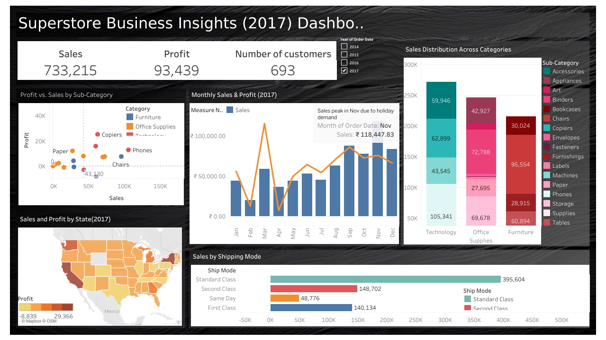

# 📊 Superstore Sales Dashboard (Tableau)

An interactive Tableau dashboard that provides a comprehensive analysis of the Superstore dataset. This project focuses on tracking key performance indicators (KPIs), exploring sales trends, and identifying profitability drivers through dynamic and user-friendly visualizations.

---

### 📸 Dashboard Preview

---

### 🔗 Live Dashboard (Tableau)

**[View the interactive dashboard live on Tableau Public](https://public.tableau.com/app/profile/nithya.reddy.banala/viz/Myfirstdashboardsuperstore/Dashboard1)**

---

### 🚀 Key Features

* **KPI Cards:** At-a-glance metrics for critical indicators like:
    * **Total Sales:** Overall revenue generated.
    * **Total Profit:** Overall profitability.
    * **Number of Customers:** Total number of unique customers
* **Sales & Profit Over Time:** Combined line and bar chart showing monthly performance, with a notable sales peak in November due to holiday demand.
* **Geographical Sales Analysis:** A map visualization that displays sales distribution by state, with color-coding using color intensity to indicate performance levels.
* **Category & Sub-Category Performance:** Bar charts breaking down sales by product category and sub-category, highlighting top-performing product lines.
* **Profit vs. Sales by Sub-Category:** A scatter plot showing which product types (e.g., Phones, Chairs, Paper) generate the most profit relative to sales.
* **Sales by Shipping Mode:** Bar chart comparing performance across Standard, Second Class, First Class, and Same Day delivery methods.
* **Interactive Year Filter:** Enables dynamic filtering of all charts based on selected year (2014–2017).

---

### 🎯 Project Purpose & Insights Discovered

This project was developed to translate a raw dataset into an actionable business intelligence tool. It solves the common business problem of needing a centralized, easy-to-understand overview of sales and profit performance.

**Key insights that can be derived from this dashboard include:**
* Identification of the most and least profitable product sub-categories.
* Understanding which geographical regions require more strategic focus.
* Recognizing seasonal sales peaks and troughs to optimize inventory and marketing efforts.

---

### 📁 Files Included

| File                                | Description                                                          |
| ----------------------------------- | -------------------------------------------------------------------- |
| `Superstore_Analysis.twbx`          | The **Tableau** Packaged Workbook with its data source and worksheets. |
| `images/superstore_dashboard_preview.png` | A preview screenshot of the main dashboard page.                     |
| `README.md`                         | This project documentation file.                                     |

---

### 🛠️ Tools & Technologies

* **Tableau Desktop:** Used for all data visualization, dashboard creation, and interactivity.
* **Data Source:** Sample - Superstore dataset by Tableau Software, widely used for educational purposes in data visualization.
* **Microsoft Powerpoint:** Used to design a clean, professional layout background for the dashboard interface.
* **Tableau Public:** Platform for hosting and sharing the live dashboard.

---

### 🔄 How to Use

To explore this project:

1.  **Clone or download** this repository.
2.  Download the dashboard from the given **[Link](https://public.tableau.com/app/profile/nithya.reddy.banala/viz/Myfirstdashboardsuperstore/Dashboard1)**
3.  Make sure you have the necessary software installed (it's free).
    * To open the **`.twbx`** file, use **Tableau Reader** or **Tableau Desktop**.

---

### How It Was Created & Problem It Solves

This dashboard was created to provide a clear and intuitive tool for business stakeholders to monitor and analyze sales and profitability. The primary problem it solves is the need for a centralized and interactive platform to explore sales data, which can help in making data-driven decisions to improve business performance.

The creation process involved:

1.  **Data Connection:** Connecting to the Superstore dataset in Tableau.
2.  **Worksheet Creation:** Building individual worksheets for each visualization (e.g., sales over time, profit map, category bar chart).
3.  **Background Creation:** Creating a background with a layout which can perfectly fit all the sheets using Powerpoint.
4.  **Dashboard Assembly:** Combining the worksheets into a single, interactive dashboard.
5.  **Formatting and Publishing:** Applying consistent formatting and publishing the final dashboard to Tableau Public.

---

### 👩‍💻 Author

**Nithya Reddy Banala**
*👩‍🎓 Final Year B.Tech Student, Data Analytics Enthusiast*

[🔗 LinkedIn](https://www.linkedin.com/in/nithya-reddy-banala-12316a2b9/)

---
⭐ *If you find this project interesting, please consider starring the repository!*
